# Intro to Computer Networks

A computer network inter-connects a group of computing devices and allows processes running on different devices to communicate by sending messages which are forwarded by intermeiate nodes in the network.

## Computer Network Components

**General structure:**

### **End hosts:**

The edges of the network, consisting of personal devices and servers that run processes requiring communication over the network, e.g. web browsers, online games, email servers, etc.

These hosts **must** be able to: break down messages into '*packets*', add '*packet headers*' to them containing necessary information to travel through the network and send the packets over a communication link.

End hosts **could** (not required) also ensure reliable and orderly delivery of the packets depending on the transfer protocol used, and control the rate of transmission of packets.

### **Network Links:**

**Packet Switches:** intermediate devices that transfer data packets between nodes on the network, e.g. switches and routers.

**Communication Links:** Physical links between network devices, e.g. ethernet, fiber, wireless links, etc.

### **Access points:**

Nodes that directly connect the end hosts to the rest of the network, e.g. home routers, institutional routers, mobile data towers, etc. They are regulated and provided by '*Internet Service Providers*' (ISPs) which are hierarchical from regional (BT, Sky, etc) to global ISPs that interconnect regional ISPs.

## **Packet Transmission**

**Routing:**

Run routing algorithms to construct routing tables - a mapping of destination IP addresses to the next destination to send packets. This is done by packet switches and changes based on network usage so not all packets sent to the same destination take the same route.

**Forwarding:**

Once a packet arrives it is forwarded to the appropriate output according to the routing table.

**store-and-forward:** The entire packet must arrive at a node before it can be transmitted to the next node. Therefore the end-to-end delay of a node from beginning of reception to end of forwarding is 2L/R where L is the amount of bits in the packet and R is the link speed in bps. A large L means that the delay is long, so unsuitable for real-time applications like remote control of machine.

### **Delays**

**Queueing delay & loss:** If the arrival rate to a node is greater than the output transmission rate then packets enter a buffer to be sent in the node. Packets are dropped (lost) if the memory buffer fills up, and this is quite common.

**Delay Types:**

- **transmission delay: dtrans**
  - L: packet length (bits)
  - R: link bandwidth (bps)
  - Dtrans = L/R
- **queueing delay: dqueue**
  - time waiting in buffer to be sent
  - dependant on congestion level of node
- **nodal processing: dproc**
  - check for bit errors
  - determining the correct output link
  - typically very small, < 1ms
- **propagation delay: dprop**
  - d: length of physical link
  - s: propagation speed in link (typically 2x108 ms-1)
  - dprop = d/s
- **total delay: dnodal**
  - sum of above delays

### **Throughput**

The rate at which bits are transferred between a specific communicating pair of nodes.

*Instantaneous:* rate at a given point in time (average over a very small period).

*average:* rate over a longer period or entire duration of communication.

'*bottleneck link*': The link on an end-to-end path with the smallest throughput, limiting the total throughput to that link's speed (average will be this throughput too).

### Packet Switching vs Circuit Switching

Packet Switching:

- Resources can be shared between flows/communicating pairs
- Packets can be delayed or lost
- Multiple flows can use the same link at once, good use of resources

Circuit Switching:

- Resources can only be used by one flow/communicating pair for the duration of communication: this is called a circuit
- Guaranteed rate of transmission and no delay/losses during communication
- Doesn't allow multiple flows to use the same resource at the same time, so poor use of resources with 'bursty' traffic

## **Communication Protocols**

Protocols define rules of communication - the format and order of messages sent/received, as well as actions taken on message transmission/receipt.

These can be implemented in software that runs on nodes/routers, or in hardware using logic. Most protocols are specified by the Internet Engineering Task Force (IETF), though other bodies like the Institute of Electronics and Electrical Engineers (IEEE) specify some standard like Ethernet and WiFi.

### Layering

Network protocols and devices need to perform many complex functions. These functions are divided into layers where layer N provides services to N+1 and uses services from N-1. Layering makes it easier to add services or change implementations in a layer without affecting the rest of the layers.

The internet protocol (IP) stack has 5 layers that contain all possible functions. Not all layers have to be present in a network device, e.g. packet switches do not use the application layer.

'*IP address*': unique software ID of an end host (not all nodes have an IP address).

'*MAC address*': Media Access Control address, the unique physical ID of a node in the network (all nodes in a network have a MAC address)

Each layer adds their own header to the packet with data specific to that layers protocols. As the packet is processed at nodes, the layers are stripped away and added with updated data to be sent to the next node, e.g. the hardware address of the next node.

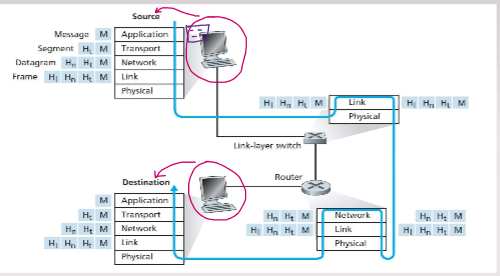

# Application Layer

## Network Applications

A process running on a host machine that uses the network to send messages to a process on a different host machine is a network application. E.g. email, peer-to-peer file sharing, web servers, etc. *Client processes* request data, and *server processes* provide data.

If not using standard protocols, a developer generally has to create both the client and server sides of the application. Standard protocols (HTTP, SMTP, etc) allow developers to only create one side, and the protocol dictates how it would communicate with the other side.

## Sockets

'*Sockets*' allow application layer user network processes access to the kernel-controlled network layers. Creating, reading from and writing to sockets is done using system calls.

## Ports

Ports are 16 bit numbers from 0-65535. These are used to identify which process running on a machine to deliver packets to once at the end host. Port numbers 0-1023 are reserved for standard network applications, e.g. 80 for HTTP, 25 for SMTP, etc. User application processes can use any other port above 1023.

# Transport Layer

All transport layer protocols offer some basic services to provide communication between processes running on different hosts:

**Send side:** break data to be sent into segments (packets), add header with port data, pass onto network layer.

**Receive side:** reassemble segments (packets) into messages, pass to application layer

There are two main transport layer protocols used in the internet: Transmission Control Protocol (TCP) and User Datagram Protocol (UDP).

## TCP

TCP provides reliable and in-order data transfer (lost packets are resent and packets are reordered) and is connection oriented - setup is required between the client and server before they can start transferring data. TCP provides flow control, matching the sender speed to the reading speed to stop receiving buffer overflows. Congestion control also limits the sending rate according to the perceived network congestion to prevent overwhelming the network and packet loss.

### Flow Control

### Congestion Control

### Reliability

TCP enhances the unreliable network layer service into a reliable transport layer service.

Unreliability in the network layer comes from:

- **bit errors:** bits get flipped due to random electrical noise
- **packet loss:** packets are lost due to buffer overflow at routers/receiver

Mechanisms to create reliability in TCP:

- **Checksums:** used to detect bit errors, includes the sum of all 16-bit words in the header - bit error has occurred if this sum is not the same.
- **ACKs:** used to indicate that a packet has been correctly received at the receiver.
- **Timeout mechanism:** Sender considers a packet lost if an ACK is not received within a timeout interval.
- **Retransmissions:** resend lost/corrupted packets, can be done using Automatic Repeat Request (ARQ).
- **Sequence number:** used to detect/identify duplicates at the receiver and identify which packets need resending.

### TCP Socket Programming

Server process must already be running and have created a socket ready for TCP setup. The client process creates a TCP socket, specifying IP address and port number which attempts to establish a connection to the server TCP socket. Once contacted by the client, the server creates a new socket for the specific connection between the server and that client, allowing a server to communicate with multiple clients.

Application view: TCP provides reliable, in-order byte-stream transfer between client and server.

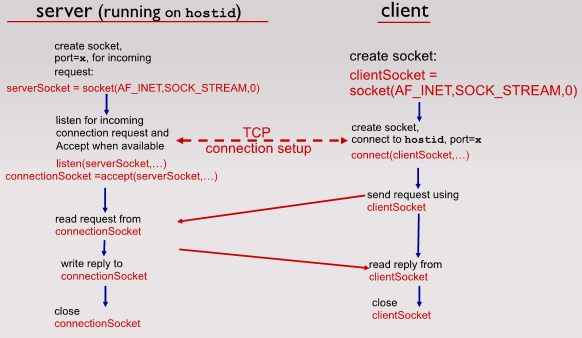

### TCP header structure

**Sequence Number:** 32-bit sequence number of the segment indicating the number of the first byte.

**ACK number:** 32-bit number of the next byte expected.

**Receive window:** used for flow control.

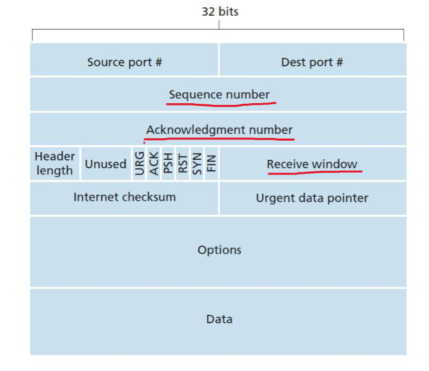

## UDP

Packetizes data and sends to the network with no effort to recover losses/reorder packets and no connection setup required - bare minimum services. As UDP does less, time to start sending packets is smaller and the headers are smaller. There is also no congestion control with UDP, so packets are sent at any rate requested even when the network is congested - this can cause issues and major packet loss.

Applications with real-time requirements like Skype/games use UDP as they require a high rate of transfer and are more tolerant to losses due to repeated updates.

### UDP Socket Programming

Connectionless socket - no synchronisation required before sending data. Sender explicitly attaches destination IP and port to each packet. Receiver extracts data, sender IP and port from the packet. Packets may be lost or received out of order. 

Application view: UDP provides unreliable transfer of groups of bytes (*datagrams*) between the client and server.

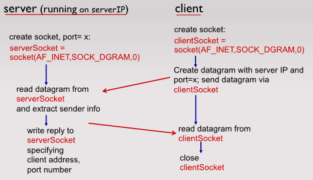

## Reliable Data Transfer

### Stop and Wait ARQ

Sender sends a packet and waits until it receives the correct ACK back before sending next packet. If the correct ACK doesn't arrive in a given time frame, then the packet is resent.

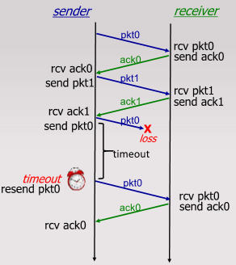

Uses an **alternating bit protocol** with packet numbers and ACKs, as each packet is confirmed received before the next is sent so at most one outstanding packet. This allows for duplicate detection.

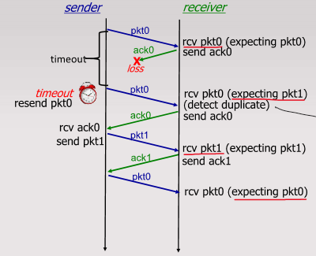

Stop and wait ARQ provides reliable data transfer, but very poor performance as the sender has to wait a minimum of the round trip time (RTT) after the first packet is sent to begin sending the next. 

If packet length L=8000 bits, link rate R = 1 Gbps (109 bps) and RTT is 0.03 seconds, the link usage proportion U is:

**Delay bandwidth product:** RxRTT is the 'delay-bandwidth product', and indicates the amount of additional data that could be sent during the round trip time.

The receiving process typically has a finite buffer (pipeline) of B bits to store incoming packets, and may not be reading from the buffer constantly. To prevent buffer overflow, the sender is limited to sending B bits before the first ACK, and the sending L bits per ACK received afterwards.

### Go-Back-N (GBN)

A pipelined protocol, where there can be multiple unacknowledged packets en-route from the sender to the receiver.

The sender sends up to N packets without waiting for an ACK. N is the send window size, and depends on the delay-bandwidth product, receive buffer size and other factors. The receiver has an '*expectedseqnum*' which keeps track of the next expected sequence number to be received.

If the receiver correctly receives packet *n* and *n*=*expectedseqnum* then ACK(n) is sent, which acknowledges all packets up to and including *n*. This is **cumulative ACK**. In all other cases (n!=expectedseqnum), the receiver discards the packet and sends ACK(n-1).

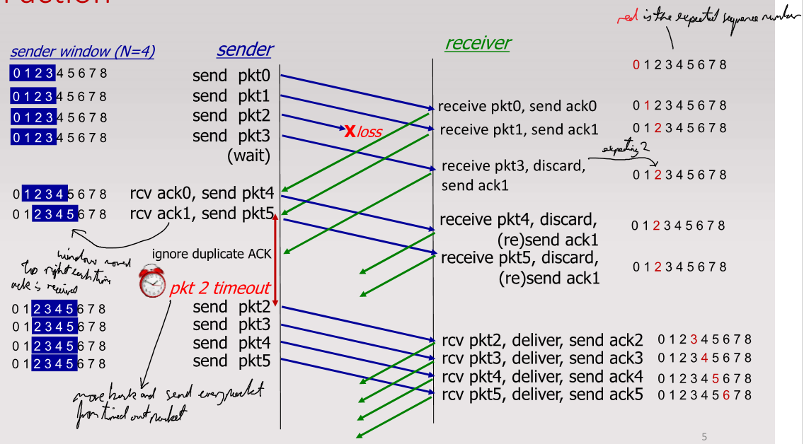

### Selective Repeat (SR)

SR is pipelined as well.

The sender sends all packets inside the window. The SR receiver does not discard out of order packets if they are within the **receive window**. ACKs are individual, not cumulative and the sender selectively resends the packets with missing ACKs.

### TCP reliable transfer protocol

Each byte of data sent over TCP is numbered - the sequence number of a transmitted TCP segment (packet) is the byte number of the first data byte of the segment. E.g. if segments are 500 bytes, the 1st segment is seq0, 2nd is seq500, 3rd is seq1000, etc. 

Only segments causing timeouts are retransmitted, otherwise the packet is buffered for later use.

The TCP ACK number sent by the receiver is the next expected byte number and is cumulative, e.g:

**Duplex communication:** In TCP, ACK can piggyback on data segments and don't require their own packet. To reduce transmissions, ACK is often sent with another segment that carries other data.

Retransmission usually only occurs when an ACK isn't received in a certain time window after the packet was sent, and if an ACK isn't received within a certain time window after the ACK for the previous packet was received (assuming the packets were sent close together).

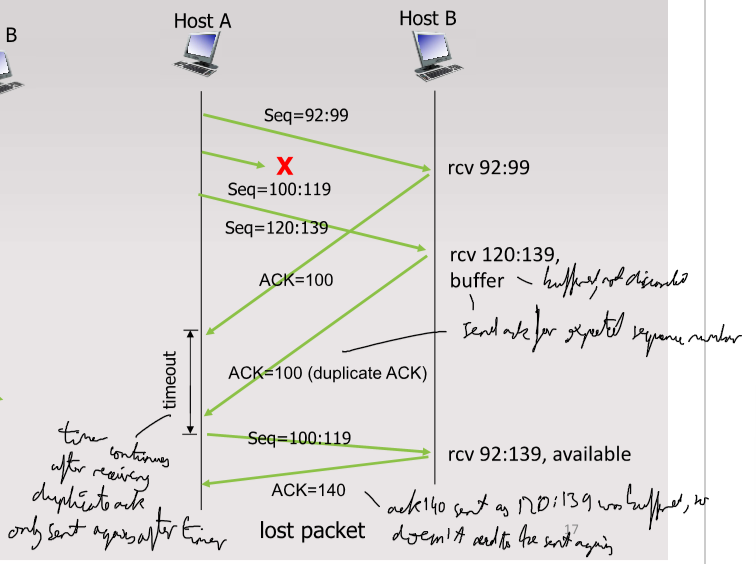

However, **TCP fast retransmit** means that upon receiving 3 duplicate ACKs requesting a segment previously sent, the TCP sender retransmits that segment without waiting for the timeout.

# HTTP (Hyper Text Transfer Protocol)

Web browsers communicate with web servers using the HTTP (and HTTPS) application layer protocol. HTTP is specified by the IETF (see above) and uses TCP with port 80. Once a TCP connection is established like usual, HTTP messages are exchanged.

## Overview

A client sends a HTTP request for a webpage to a web server 'hosting' webpages. The server responds with a HTTP message containing the requested webpage(s).

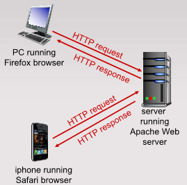

## Web Pages

Consists of objects, all of which are files. These objects (HTML files, JPEG files, JSON files, etc) are addressable by a URL, e.g. "www.site.com/images/cat.png". In this example, "www.site.com" is the host name (maps to the server IP address) and "images/cat.png" is the path name, a path within the file directory of the server that is accessible to clients.

Most pages are HTML files containing referenced objects like images or text files.

## Connection Types

### **Non-persistent (HTTP v1.0):**

Each object is downloaded over separate TCP connections, so multiple objects require multiple TCP connections.

1) Client sends SYN, server responds with SYN-ACK
2) Client sends ACK and begins HTTP messages - requests the base HTML file
3) Server sends a HTTP response with the requested file attached
4) Server closes TCP connection
5) Client examines HTML file and identifies any other objects that are required
6) Steps 1-4 are repeated for all referenced files - inefficient

Has a long response time due to repeated opening/closing of TCP connections. Total time to load the pages is: number of files \* (2 \* RTT + file transmission time)

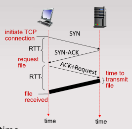

As well as long response timings, this also increases overhead in the server due to the repeated allocation of resources to creating new TCP connections.

### **Persistent (HTTP v1.1+):**

Multiple objects can be sent over a single TCP connection - server leaves the connection open after sending HTTP response. Subsequent HTTP messages are sent over the same open connection. 

Total time to load the page is: 2 \* RTT + total file transmission time

## HTTP message Format

### Request

### Response

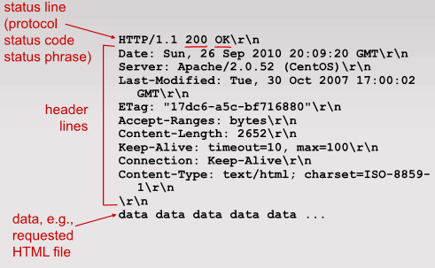

## Web caching

A web cache is installed in a network. Clients can be configured to access the web using the web cache. HTTP requests are sent through the web cache - if the requested object is in the web cache then the cache returns the object - reducing response time and traffic in the ISP network (reduces cost for ISP) and internet as a whole. If the object is not in the cache, then the cache makes a request to the origin server and returns the object to the client itself.

Caches are usually installed by ISPs or companies to serve requests of popular contents and reduce costs.

# Misc Topics

## Network Interfaces

A point of connection between a computer and a network - a computer can have multiple, e.g. WiFi and Ethernet/multiple ethernet ports. An interface usually takes the form of a network interface card (NIC), but can be software only, e.g. **loopback interface (localhost)** is not a physical device.

Each network interface has an IP address if connected to any network, and hardware NIC always have MAC addresses.

## Link Layer headers (Ethernet Header)

Fixed length of 14 bytes

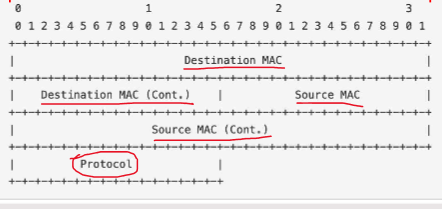

MAC address: 48bits/6bytes each,  describes the interfaces between which the packet has traversed

protocol: 16bits/2bytes describes protocol of the next layer, e.g. 0x0800 for IPv4, 0x0806 for ARP

## Network layer header (IPv4 header)

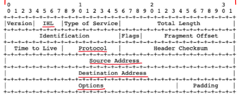

IHL: 4bits, stores the length of header in 4 byte words

protocol: 8bits/1byte, describes protocol of the next layer

addresses: 32bits/4bytes, the IPv4 addresses of computers traversed between

# Cyber Attacks

## SYN Attack

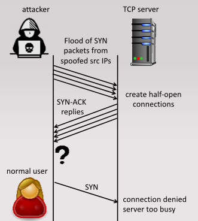

## ARP cache poisoning

ARP: Address Resolution Protocol

Header reminders: source and destination IP addresses do not change in a packet. The MAC addresses change with each hop between nodes in the network, as these identify network interfaces.

The network header contains the destination IP address, which can then identify the IP address of the node which the packet should be sent to on the next hop, but not the MAC address. The router must be able to identify this MAC address to add to the link header. This is done through ARP.

The router broadcasts an ARP request to all interfaces it is connected to, asking which interface has the IP address that it needs.

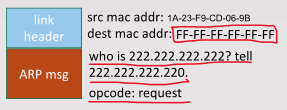

The node with the correct IP address then sends an ARP reply packet with data stating that it is the node with that IP address. This mapping of IP to MAC is then stored the ARP cache for future use.

ARP also allows unsolicited replies (no request necessary) to allow for IP address changes. An attacker can poison the ARP cache by sending unsolicited ARP replies claiming to be other nodes, routing packets meant for another node to them instead.
