# Basic Quantum Mechanics

## Atomic Electron Orbital Shapes

- electron orbital names:
  - s = sharp
  - p = principal
  - d = diffuse
  - f = fundamental/fine

## Madelung's Rule

Energy ordering is from lowest n+l to highest: if n+l is the same, fill orbital with smaller n.

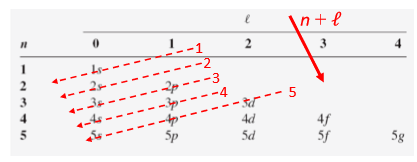

## Pauli Exclusion Principle

- n = principal quantum number (1, 2, 3, ...)
- l = orbital angular momentum (0, 1, 2, ...)
- ml = magnetic quantum number, z component of l, |ml| <= l
- ms = spin magnetic quantum number, 1/2 or -1/2
- pauli exclusion principle: no two electrons in a given system may have all 4 numbers the same

## Hund's rule

- For a given electron config, lowest energy term has the greatest spin multiplicity
- if two or more orbitals of equal energy are available, electrons occupy them first individually, then pair up as more are added

## Orbital Occupancy of first 10 elements H to Ne

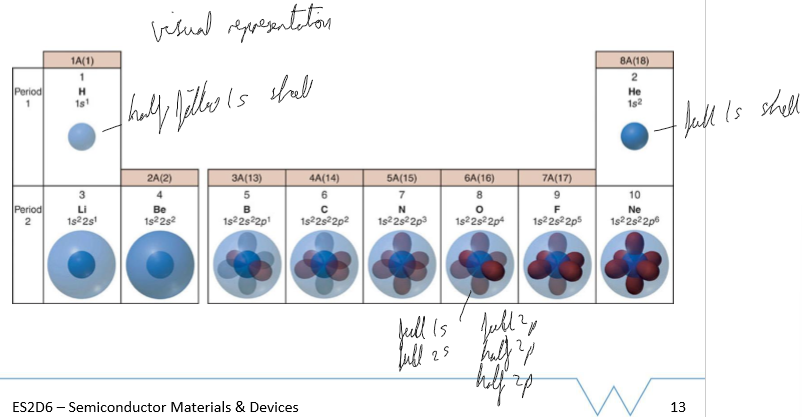

## Heisenberg's Uncertainty Principle

more precisely position is know, less precisely the momentum can be known at the quantum level and vice-versa.

for electron trapped in a 1D (just width) infinite potential well from x=0 to x=a, the uncertainty in position Δx = a. From de Broglie, px=h/λ = ħk or -ħk where k is wave vector 2π/λ and λ=a as fixed length. Δpx=2ħk as ranges from ħk to -ħk. Therefore:

 \
h should be ħ for greater accuracy

## Valence shells

Valence shell is the outermost occupied shell of an atom

## Wavefunction

square of the wavefunction is the electron probability distribution, wavefunction is a representation of the orbital

## bonding and antibonding orbitals

wavefunction of atoms close together, the orbitals interact. Can be bonding (additive) or antibonding (subtractive)

## Energy Bands

Example: Lithium has 1 electron in 2s orbital, so N (assumed large, 1023) electrons in N 2s orbitals. As N atoms are brought together, N energy levels formed as pauli exclusion principle. Max spread of levels when atoms spaced at inter-atomic distance a. The N energy levels form an energy band with 2N states as 2 electrons can fit in each orbital. 2s band is therefore half full.

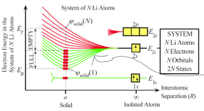

At absolute 0K, bands are full from lowest EB to fermi level EF. Energy needed to excite electron from fermi level to vacuum (escape) is work function Φ of metal.

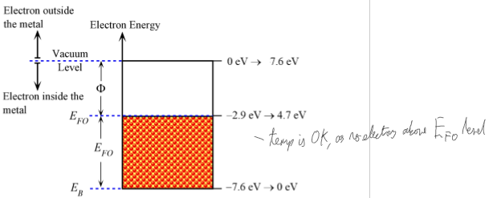

## Fermi-Dirac Function, Fermi levels, Fermi function

f(E) defines probability that a state with energy E is occupied by an electron.

 \
as temp increases, greater probability at higher energies and lower probability at lower energies.

## Boltzmann statistics fermi distribution approximation

assume that fermi-dirac function is equal to \

## Semiconductors

- Some free electrons, but not a lot.
- Valence band - full at 0K, bonding orbital
- conduction band - empty at 0K, antibonding orbital
- bandgap between them with energy Eg
- Electrons jump from valence band to conduction band when excited, with holes moving from conduction to valence band

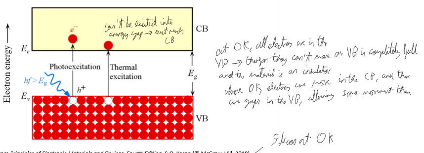\
At 0K, electrons can't move in the VB and there are none in CB so it is an insulator. \
Above 0K, there are some electrons in the CB so some space in the VB and electrons can move in VB, so no longer an insulator.

## Crystal Structures

### Face Centred Cubic FCC

Cubic cell, atom in each corner and in centre of each face. \
Atomic Packing Factor APF = 0.74

### Body Centred Cubic BCC

Cubic cell, atom in each corner and one in centre. \
Atomic Packing Factor APF = 0.68

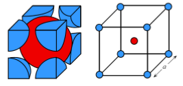

### Hexagonal Close Packed HCP

Hexagonal layers, stacks of triangles. Often two laters of ABAB... but can be 4 of ABCDABCD... \
Can be shown as full hexagons or small 4 with 4 points. \
Atomic Packing Factor APF = 0.74

### Diamond Unit Cell DUC

Similar to FCC, but with more atoms placed equidistant from atoms in a quarter of the cube. \
Elemental semiconductors Si, Ge have this structure. \
Atomic Packing Factor APF = 0.34

### Zinc Blende Cubic Crystal Structure

Same as Diamond Unit Cell but with 2 different types of atom, example is Zinc Sulphide. \
Many compound semiconductors have this: AlAs, GaAs, GaP, GaSb, InAs, InP, InSb, ZnS, ZnTe

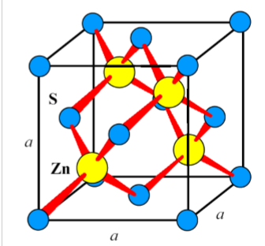

### Bravais Lattice Summary

## Crystal Structure Geometry

Miller indices - all parallel vectors have the same indices, exact length directions shown in square brackets, equivalent directions shown in angular brackets.

Calculating Planes: \

## Intrinsic Semiconductors vs Extrinsic Semiconductors

- intrinsic - almost perfect, few/no impurities
- extrinsic - significant impurities
  - donor - donates electrons, material becomes n-type with electrons as majority carrier
  - acceptor - accepts electrons (donates holes), material becomes p-type with holes as majority carrier

## Electrons and Holes

- electrons - can be treated as free moving in CB, has effective mass me
- holes - can be treated as free moving in VB, has effective mass mh

## Density of States DOS

Density of States g(E) or DOS(E) is such that g(E)dE is the number of states (wave-functions) in the energy interval E to E+dE. The number of states per unit volume up to E' is: \

## Electrons in Intrinsic Semiconductor, Concentration of Electrons in Covalence Band CB Intrinsic Semiconductor

Concentration of electrons in CB: \
 \
Subbing in boltzmann approximation of f(E): \
 \
Splitting into n and Nc: \
 \
Nc is the effective density of states at the CB edge

## Holes in Intrinsic Semiconductor, Concentration of Holes in Valence Band VB Intrinsic Semiconductor

probability of electron = f(e), so probability of hole = 1 - f(e) \
Concentration of holes in VB: \
 \
This can be reduced to p and Nv: \
 \
 \
Nv is the effective density of states at the VB edge

## Mass Action Law Intrinsic Carrier Concentration

States np = ni2 where ni is the intrinsic carrier concentration. ONLY APPLIES IN THERMAL EQUILIBRIUM AND IN THE DARK. \
 \
np is constant as holes in valence band = electrons in conduction band, and depends on material properties Nc, Nv and Eg. \
Can multiply out Nc and Nv and others to get: \

Materials considered intrinsic if ni >> doping concentration.

## Intrinsic Carrier Concentration vs Temperature

As temp increases, intrinsic carrier concentration also increases: \
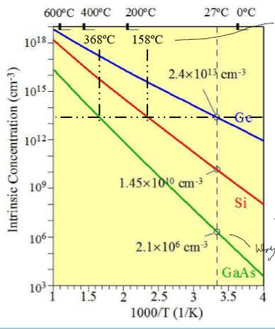

## Fermi energy in intrinsic semiconductors fermi level instrinsic

-  \
- EFi = fermi energy, where f(E) = 0.5
- Ev = top edge of valence band
- Ec = bottom edge of conduction band
- Eg = Ec - Ev
- k = boltzmann constant
- T = temp in kelvins
- Nc = effective density of states at CB edge
- Nv = effective density of states at VB edge
- if Nc = Nv:
  - 
  - fermi energy is midpoint of the energy gap
- as  we can write:
  - 
- multiplying out Nc and Nv and others:
  - 

## Doping N-Type

Add impurities with larger amount of valence electrons than original material to produce "free electrons", e.g. adding Sb to Si crystal as Sb has 5 valence electrons and Si has 4. \
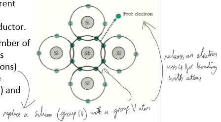

Si doped with As: \
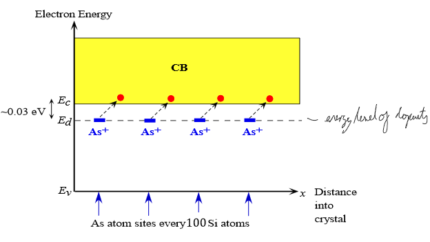

## Doping P-Type

Add impurities with less valence electrons than original to add "holes". e.g. adding B to Si as B has 3 valence electrons and Si has 4. \

Si doped with B: \
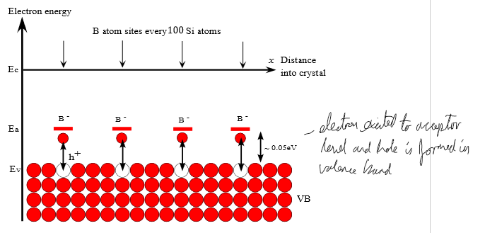

## Binding energy

Binding energy of donor carrier (swap Me for Mh for holes) in material (orbits around donor atom until this energy met):\

## Majority Carrier and Majority Carrier Concentration in Doped Semiconductors

Electrons and Holes are carriers of charge. Whichever carrier is present in the largest number is the majority carrier: **Holes in p-type, electrons in n-type**. The other is the minority carrier.

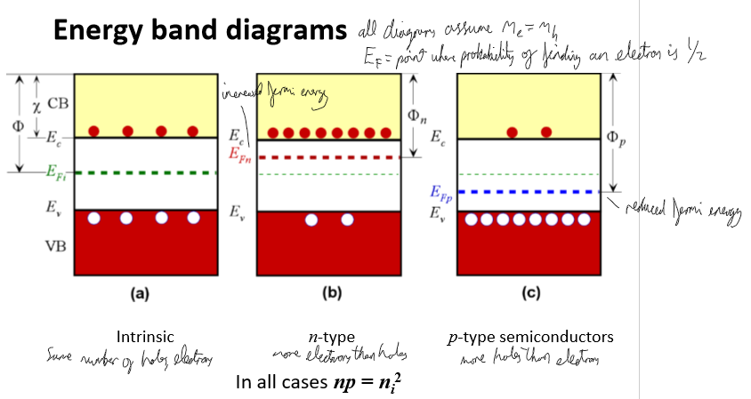

ND = electron donors, NA = electron acceptors
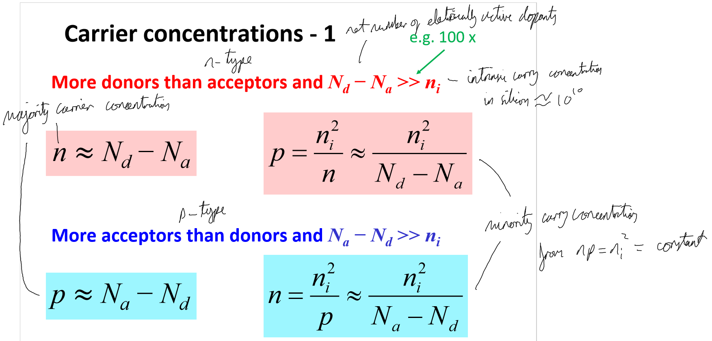

If |ND - NA| ~ ni2, then: \
N-type:  \
P-type: 

## Majority carrier concentration in Doped Semiconductors Against Temperature 1/T

## Degenerate Semiconductors

If doping very high (1019cm-3+ in Si), can no longer use Boltzmann statistics and must use full Fermi-Dirac Equation as fermi level may lie within CB or VB. Therefore, np=ni2, n=Nd and p=Na are not valid.

## Compound Semiconductors III-V Semiconductors 3-5 Semiconductors

Have group III (3 electrons in valence) and group V (5 electrons in valence) in a unit cell bonded, most likely in zinc blende crystal structure. Acts as 'intrinsic'. Doped: \
N-type by replacing V atoms with VI atoms (as VI is more similar to V than III) \
P-type by replacing III atoms with II atoms (as II is more similar to III than V) \
Doping with IV is ambiguous as could replace V or III, unknown doping outcome.

## Typically Semiconductor Properties Si SiC Ge GaN GaAs InGaAs InAs InSb

## Semiconductor uses with different band gaps

### Wide band gap uses Eg > 2.5eV

typical semiconductors: SiC, GaN, InGaN \
electronic uses: high power/temp electronics as more stable: electric vehicles, grid power, radar, high voltage switching
optical (III-V) uses: white light and UV light sources: LEDs and lasers

### Intermediate band gap uses 2.5eV > Eg > 0.6eV

Typical semiconductors: Si, Ge, GaAs, GaP, InP, InGaAs \
electronic uses: all modern electronics (transistors, diodes, etc)
optical (III-V) uses: visible/high IR LEDs, lasers, detectors and solar cells

### Low band gap uses 0.6eV > Eg

Typical semiconductors: Sn (alpha), GaSb, InAs, InSb \
electronic uses: magnetic sensors, high frequency electronics
optical (III-V) uses: mid IR LEDs, lasers, detectors

## Electric Current Density Jx and Drift Velocity vdx (classical)

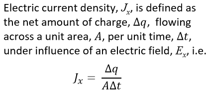 \
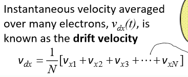 \
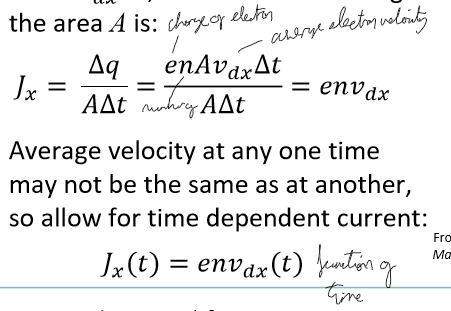

Using v=u+at for electrons and u=0 due to scattering: \

Mean free time (relaxation time) is time between collisions, so: \

Drift mobility ud is a constant of proportionality, can be subbed into vdx and Jx: \

Electrons and holes have individual mobilities: \
 \

visual of why Ex causes current to flow (it effectively causes the bands to bend, band bending):\
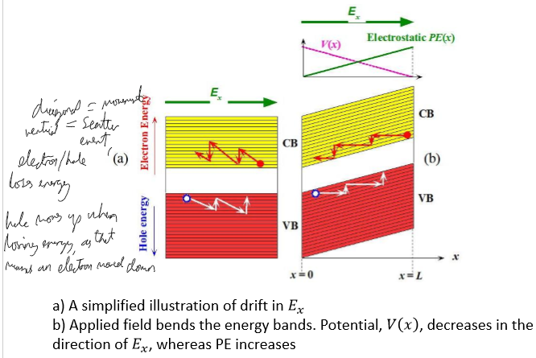

conduction current or total current density J can be split into electron and holes: \
 \

This assumed: relaxation time independent of electric field, all electrons have same mass, avg velocity of any 1 electron = avg of all electron velocties. \
Reasonable assumption for metals/large semiconductors. Doesnt work for small devices with small number of carriers/short distances for electrons to travel, high electric fields so saturation velocity reached, high doping so mass not the same for all electron/hole concentrations.

## Drift mobility temperature dependance

\
see lattice impurity scattering and lattice vibration scattering for why the below graph occurs: \
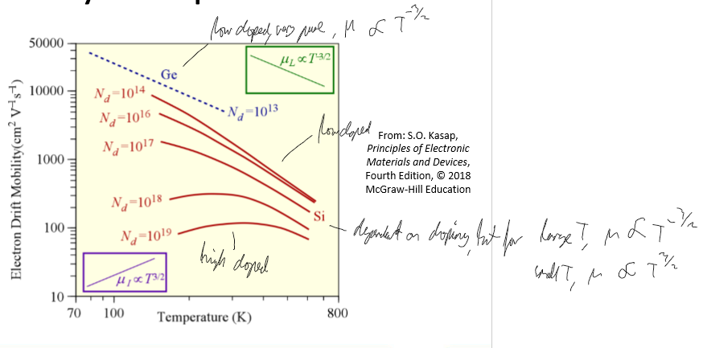

## Thermal Velocity

Typically thermal velocity >>> drift velocities in metals: semiconductors allow for drift velocities comparable to thermal velocities.

## Scattering Processes

### Matthiessen's Rule

Scaterring occurs due to thermal lattice vibrations, impurities and crystal grain boundaries (from impurities/imperfect growth). Matthiessen's Rule gives total scattering probability and total drift mobility. \

### Lattice Vibration Scattering (classical)

 \
S = cross-sectional area of the scatterer \
Vth = thermal velocity of carrier \
Ns = number of scatterers per unit volume (m-3) \
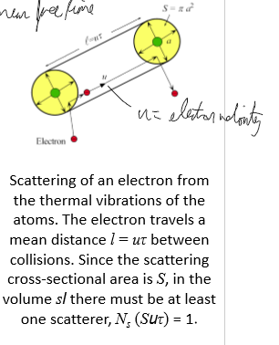 \
a = amplitude of the atomic vibrations about the equilibrium, a2 is proportional to temp T \
S = pi*a2

### Lattice Impurity Scattering Impurities Scattering

## Recombination Processes

Free electron finds an incomplete bond, moves from CB to VB. At above 0K thermal excitation constantly moves electrons from VB to CB, and in equilibrium electrons must move from CB to VB at same rate. Excess energy from recombination lost as photon.\
 \
k = wavevector, 'direction' of wave. Momentum must be conserved, so when electron moved from CB to VB must keep the same k. \
 \
Left: direct bandgap, electrons in base of CB have same k as holes in top of VB. \
Right: indirect bandgap, electrons in base of CB have different k to holes in top of VB.

### Radiative Recombination

Needs direct bandgap, electrons move direct from bottom of CB to top of VB and keep the same k.

### Shockley-Read-Hall Recombination SRH Recombination

Electrons moves (is captured by) from CB to a SRH recombination centre between the CB and VB, and then the SRH centre captures a hole from VB and electron moves to VB. Accommodates momentum mismatch by absorption/emission of phonons (lattice vibrations). SRH centres are impurities or crystal defects, so have different bandgaps to rest of material. \

Trapping: Similar to SRH, trapping centre takes in electron from CB and holds it, then releases it back to CB when excited. \

