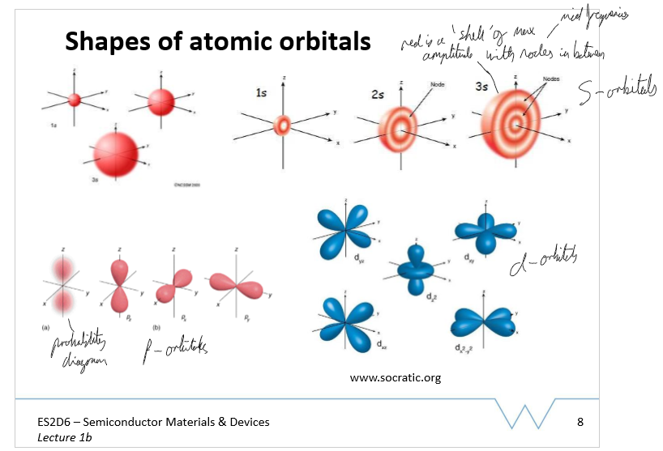
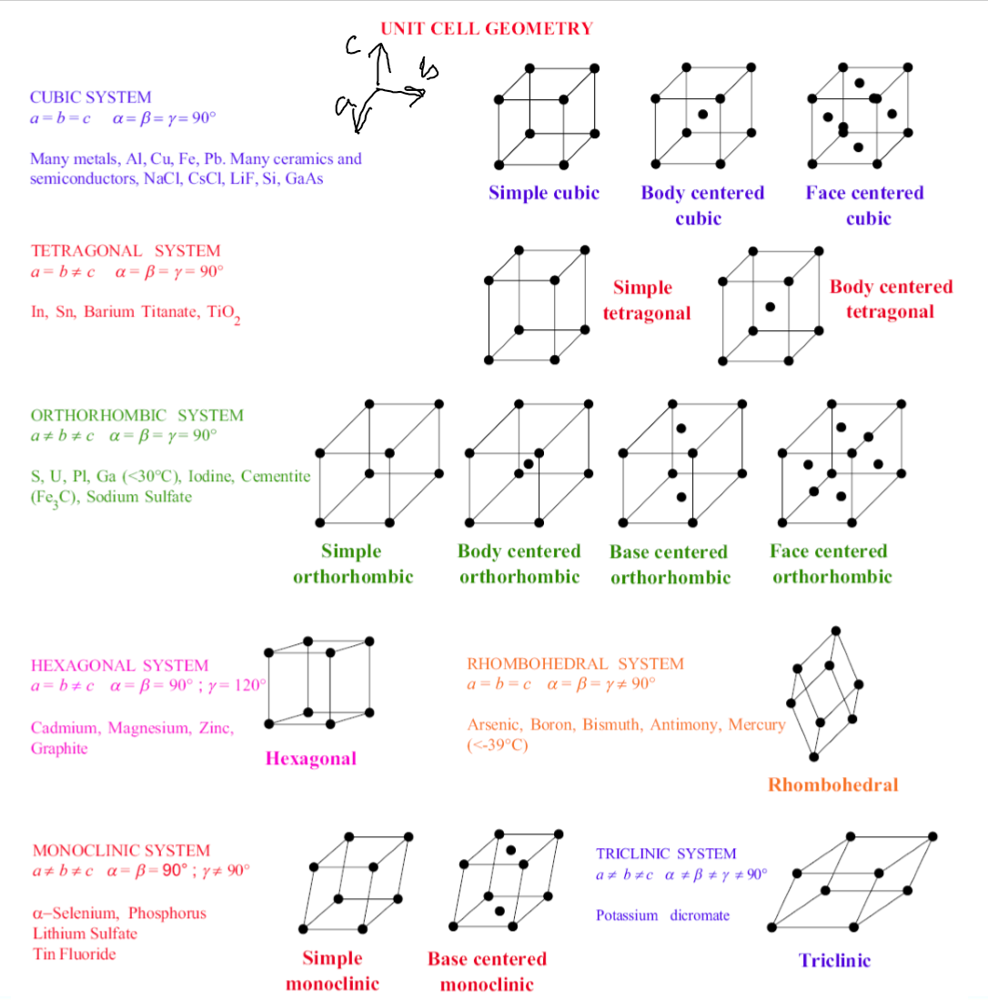
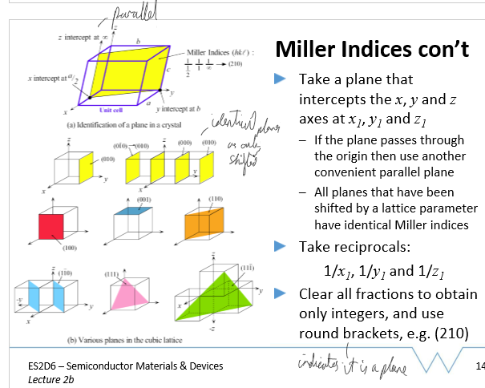

# Basic Quantum Mechanics

## Atomic Electron Orbital Shapes

- electron orbital names:
  - s = sharp
  - p = principal
  - d = diffuse
  - f = fundamental/fine

## Madelung's Rule

Energy ordering is from lowest n+l to highest: if n+l is the same, fill orbital with smaller n.

## Pauli Exclusion Principle

- n = principal quantum number (1, 2, 3, ...)
- l = orbital angular momentum (0, 1, 2, ...)
- ml = magnetic quantum number, z component of l, |ml| <= l
- ms = spin magnetic quantum number, 1/2 or -1/2
- pauli exclusion principle: no two electrons in a given system may have all 4 numbers the same

## Hund's rule

- For a given electron config, lowest energy term has the greatest spin multiplicity
- if two or more orbitals of equal energy are available, electrons occupy them first individually, then pair up as more are added

## Orbital Occupancy of first 10 elements H to Ne

## Heisenberg's Uncertainty Principle

more precisely position is know, less precisely the momentum can be known at the quantum level and vice-versa.

for electron trapped in a 1D (just width) infinite potential well from x=0 to x=a, the uncertainty in position Δx = a. From de Broglie, px=h/λ = ħk or -ħk where k is wave vector 2π/λ and λ=a as fixed length. Δpx=2ħk as ranges from ħk to -ħk. Therefore:

 \
h should be ħ for greater accuracy

## Valence shells

Valence shell is the outermost occupied shell of an atom

## Wavefunction

square of the wavefunction is the electron probability distribution, wavefunction is a representation of the orbital

## bonding and antibonding orbitals

wavefunction of atoms close together, the orbitals interact. Can be bonding (additive) or antibonding (subtractive)

## Energy Bands

Example: Lithium has 1 electron in 2s orbital, so N (assumed large, 1023) electrons in N 2s orbitals. As N atoms are brought together, N energy levels formed as pauli exclusion principle. Max spread of levels when atoms spaced at inter-atomic distance a. The N energy levels form an energy band with 2N states as 2 electrons can fit in each orbital. 2s band is therefore half full.

At absolute 0K, bands are full from lowest EB to fermi level EF. Energy needed to excite electron from fermi level to vacuum (escape) is work function Φ of metal.

## Fermi-Dirac Function, Fermi levels, Fermi function

f(E) defines probability that a state with energy E is occupied by an electron.

 \
as temp increases, greater probability at higher energies and lower probability at lower energies.

## Boltzmann statistics fermi distribution approximation

assume that fermi-dirac function is equal to \

## Semiconductors

- Some free electrons, but not a lot.
- Valence band - full at 0K, bonding orbital
- conduction band - empty at 0K, antibonding orbital
- bandgap between them with energy Eg
- Electrons jump from valence band to conduction band when excited, with holes moving from conduction to valence band

\
At 0K, electrons can't move in the VB and there are none in CB so it is an insulator. \
Above 0K, there are some electrons in the CB so some space in the VB and electrons can move in VB, so no longer an insulator.

## Crystal Structures

### Face Centred Cubic FCC

Cubic cell, atom in each corner and in centre of each face. \
Atomic Packing Factor APF = 0.74

### Body Centred Cubic BCC

Cubic cell, atom in each corner and one in centre. \
Atomic Packing Factor APF = 0.68

### Hexagonal Close Packed HCP

Hexagonal layers, stacks of triangles. Often two laters of ABAB... but can be 4 of ABCDABCD... \
Can be shown as full hexagons or small 4 with 4 points. \
Atomic Packing Factor APF = 0.74

### Diamond Unit Cell DUC

Similar to FCC, but with more atoms placed equidistant from atoms in a quarter of the cube. \
Elemental semiconductors Si, Ge have this structure. \
Atomic Packing Factor APF = 0.34

### Zinc Blende Cubic Crystal Structure

Same as Diamond Unit Cell but with 2 different types of atom, example is Zinc Sulphide. \
Many compound semiconductors have this: AlAs, GaAs, GaP, GaSb, InAs, InP, InSb, ZnS, ZnTe

### Bravais Lattice Summary

## Crystal Structure Geometry

Miller indices - all parallel vectors have the same indices, exact length directions shown in square brackets, equivalent directions shown in angular brackets.

Calculating Planes: \

## Intrinsic Semiconductors vs Extrinsic Semiconductors

- intrinsic - almost perfect, few/no impurities
- extrinsic - significant impurities
  - donor - donates electrons, material becomes n-type with electrons as majority carrier
  - acceptor - accepts electrons (donates holes), material becomes p-type with holes as majority carrier

## Electrons and Holes

- electrons - can be treated as free moving in CB, has effective mass me
- holes - can be treated as free moving in VB, has effective mass mh

## Density of States DOS

Density of States g(E) or DOS(E) is such that g(E)dE is the number of states (wave-functions) in the energy interval E to E+dE. The number of states per unit volume up to E' is: \

## Electrons in Intrinsic Semiconductor, Concentration of Electrons in Covalence Band CB Intrinsic Semiconductor

Concentration of electrons in CB: \
 \
Subbing in boltzmann approximation of f(E): \
 \
Splitting into n and Nc: \
 \
Nc is the effective density of states at the CB edge

## Holes in Intrinsic Semiconductor, Concentration of Holes in Valence Band VB Intrinsic Semiconductor

probability of electron = f(e), so probability of hole = 1 - f(e) \
Concentration of holes in VB: \
 \
This can be reduced to p and Nv: \
 \
 \
Nv is the effective density of states at the VB edge

## Mass Action Law Intrinsic Carrier Concentration

States np = ni2 where ni is the intrinsic carrier concentration. ONLY APPLIES IN THERMAL EQUILIBRIUM AND IN THE DARK. \
 \
np is constant as holes in valence band = electrons in conduction band, and depends on material properties Nc, Nv and Eg. \
Can multiply out Nc and Nv and others to get: \

## Intrinsic Carrier Concentration vs Temperature

As temp increases, intrinsic carrier concentration also increases: \

## Fermi energy in intrinsic semiconductors fermi level instrinsic

-  \
- EFi = fermi energy, where f(E) = 0.5
- Ev = top edge of valence band
- Ec = bottom edge of conduction band
- Eg = Ec - Ev
- k = boltzmann constant
- T = temp in kelvins
- Nc = effective density of states at CB edge
- Nv = effective density of states at VB edge
- if Nc = Nv:
  - 
  - fermi energy is midpoint of the energy gap
- as  we can write:
  - 
- multiplying out Nc and Nv and others:
  - 