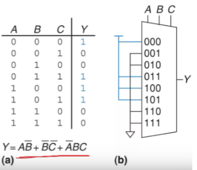
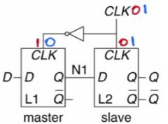
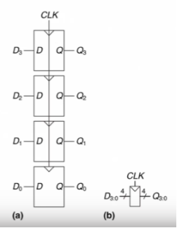
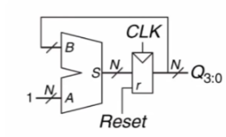
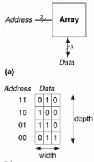
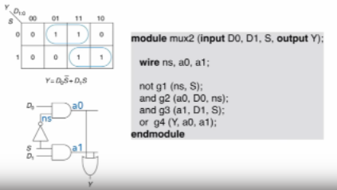

# Combinatorial Logic

## Intro to Combinatorial

**Combinatorial Logic:** combines inputs in some way to generate an output without depending on any other factors (including previous inputs). For a given set of inputs there can be only one output.

Combinatorial circuits can have multiple layers, creating a hierarchy where there are sub-combinatorial elements:

If there are any non-combinatorial elements, multiple nodes connected to the same input node or cyclic paths then the circuit is no longer combinatorial.

### Basic Boolean Algebra

- AND = ·
- OR = +
- XOR = ⊕
- NOT = ’

**Karnaugh Maps:** Alternative to truth tables where adjacent cells differ in input values by only 1 bit, allows simplification of a logic expression by finding groupings in sizes of powers of 2:

Y = A’B’C’ + A’B’C + ABC’ + AB’C’ + AB’C is reduced to Y = AC’ + B’

Minterm: a distinct input array where the overall output can be defined as the sum of the minterms which result in an output of 1, e.g.

## Common Combinatorial Circuits

### Multiplexer (Mux)

Control signals decide which input should be connected to the output. Multiplexers can also be used to build logic functions by setting the inputs as constant and varying the control signals.

### Decoders

Use k input bits to produce 2^k output bits where one is active (high/low) and the others are inactive (low/high). Useful for accessing memory addresses.

### Priority Encoder

Equal number of input and output bits where there is an order of priority for the input bits, and the output bit corresponds to the highest priority input that is active.

# Sequential Logic

## Intro to Sequential

**Sequential Logic:** inputs and memory are combined to create the output. Previous inputs affect the current output.

## Basic Sequential Circuits

### SR-type latch

The simplest circuit for storing one bit of data. Setting R high sets the output to 0, setting S high sets the output to 1, setting both high sets Q and Q' to 0, setting both low retains Q and Q' from the previous output.

Unpredictable behaviour occurs if both S and R are 1, then both are set to 0 at the same time. The output will be stable but is uncertain.

### D-type latch

This extends the SR-latch to fix the unpredictable behaviour by ensuring that R and S will have different inputs. Also introduces a CLK signal that controls when the output of the latch is updated.

### Flip-flop

Made from 2 D-type latches linked together in the basic form. The output only changes to match D on the rising edge of the clock from 0 to 1 as while CLK = 1 the master D-type no longer changes its output to match D.

Also drawn as:

### Registers

A bank of flip-flops with a common clock can act as a register to store multiple bits that can be accessed in parallel.

Shift-registers are a chain of flip-flops passing data from one to the next at each rising edge, and can be accessed in parallel or sequentially by reading only the final bit each clock.

### FIFO Buffer

Formed by connecting whole registers in the shift-register pattern - a multibit input/output shift-register.

### Counters

Generates a sequence of outputs, typically a rising/falling sequence of binary numbers changing by 1 each time.

### Synchronous Memory

To store more data, multiple registers share an output data line. Addressing inputs signals allow different registers to be accessed and connected to the output data line. An address signal with N bits can differentiate between 2^N registers/memory locations using a decoder.

## Clocks

Oscillate between 0 and 1 at a fixed frequency. The period of the clock is the time to complete 1 cycle - the time between rising edges. The oscillations are often created using an external crystal oscillator. For low-level digital design there is typically a single clock in the system that all sequential components use. For more complex designs, there is a single source clock which is then used to generate multiple clock signals to allow for sequential circuits to have different frequencies.

# Verilog

Verilog is a hardware description language - code which describes logical functions which are implemented using LUT in an FPGA. Designs are broken into modules, separate files that encapsulate some functionality. The modules can create instances of other modules for use within the module, with good designs having levels of hierarchy.

### Modules

Each module is declared with the `module` keyword and a list of ports - the inputs/outputs to the module.

## Verilog Basics

**Identifiers:** Names of modules, signals, ports, registers, etc. They must start with a letter, can contain letters, numbers and underscores and can't be the same as a keyword.

### Gates

The basic gates are inbuilt to verilog: `and`, `or`, `not`, `nand`, `not`, `xor`, `xnor`. These are called using their names, typically in the form:
`and andgate1 (outputwire1, inputwire1, inputwire2);`

Verilog multiplexer example:

